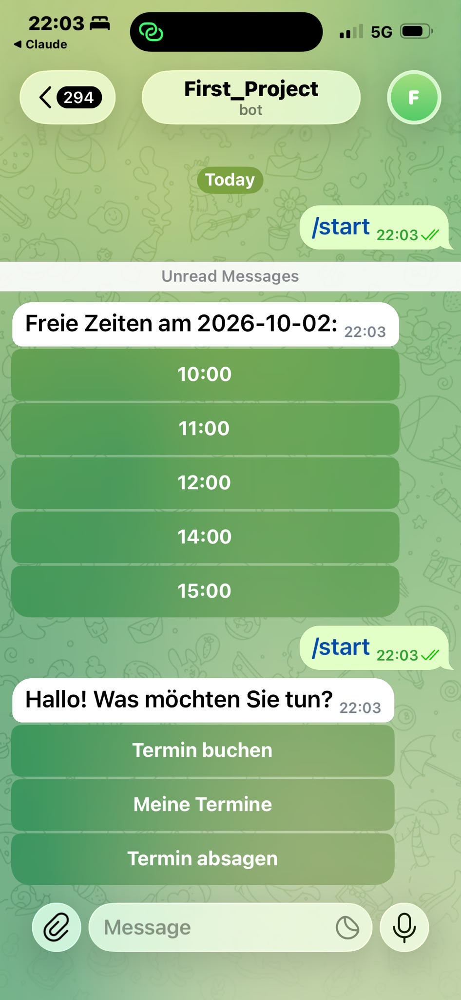
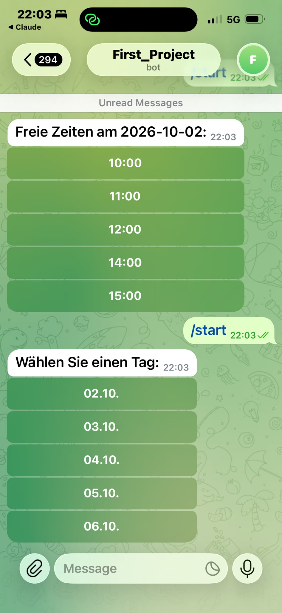
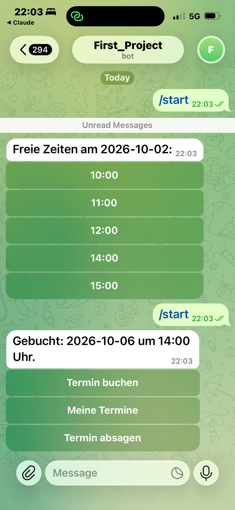
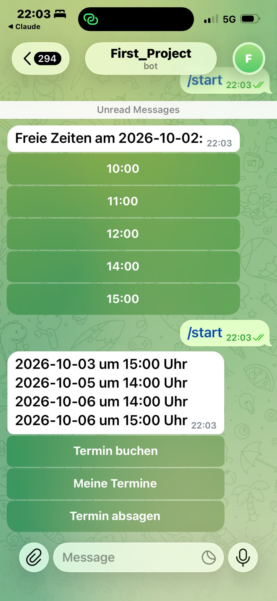
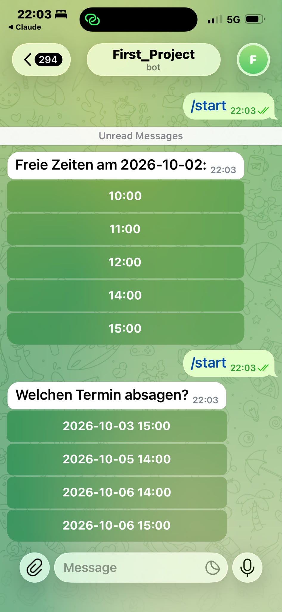
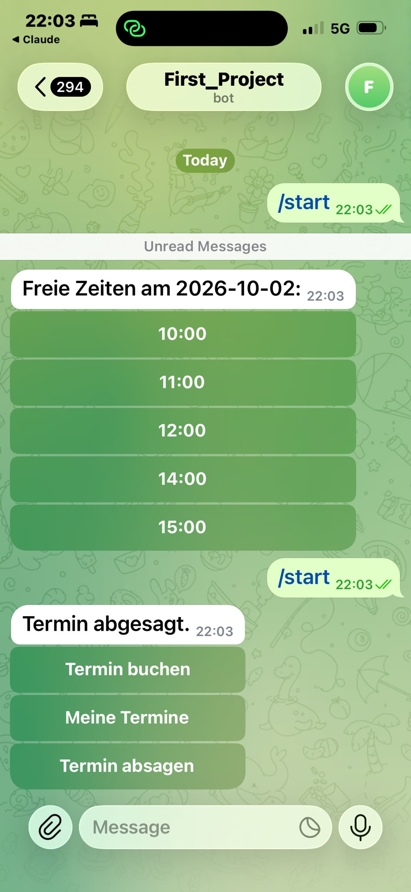

# Booking Bot

Telegram bot for appointment booking, built with Python, python-telegram-bot and SQLite.
## Screenshots
  
  
## Features
- Choose a day and a free time slot via inline buttons
- View and cancel your own appointments
- Taken slots are hidden, so double bookings are blocked
- Owner gets a notification in a Telegram chat or group on every new booking

## Setup
pip install -r requirements.txt
export BOT_TOKEN="your_bot_token"
export OWNER_ID="chat_id_for_notifications"
python bot.py